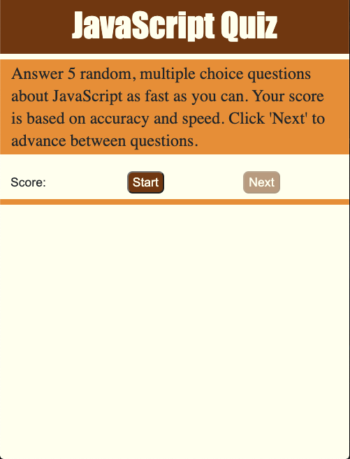
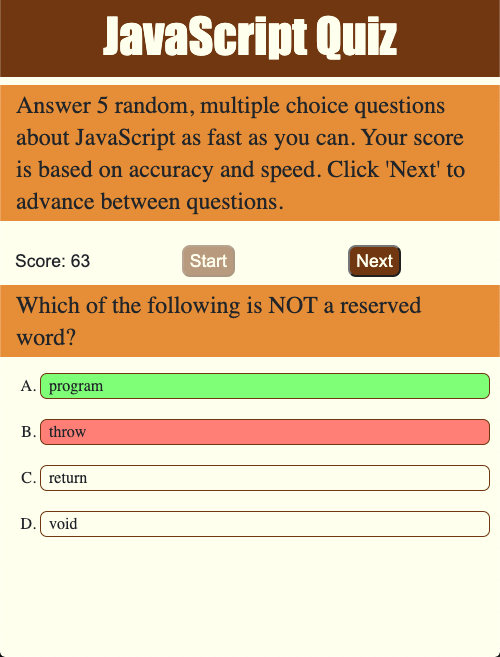

# code-quiz
# 04 Web APIs: Code Quiz

https://elwiller.github.io/code-quiz/

This is a simple JavaScript Quiz in which the user will answer five random questions.

The answers are also presented in a random order.

The quiz is scored and timed so answering questions both quickly and accurately is important.

The score starts at 100 and the user loses 1 point per second and 10 points for a wrong answer.

When the user clicks `Start` the first question is presented and the timer starts taking points.

After clicking on an answer, the correct answer is highlighted and the user clicks `Next` to continue.

After 5 questions have been asked, the `Start` button can be pressed to start another quiz.

